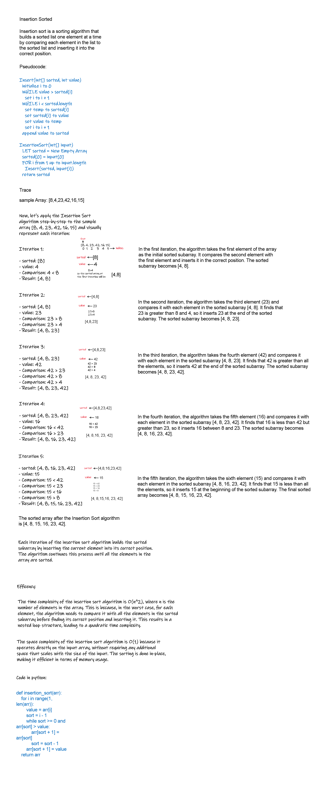

# Insertion Sorted
<!-- Description of the challenge -->

## Whiteboard Process
<!-- Embedded whiteboard image -->


## Approach & Efficiency

The time complexity of the insertion sort algorithm is O(n^2), where n is the number of elements in the array. This is because, in the worst case, for each element, the algorithm needs to compare it with all the elements in the sorted subarray before finding its correct position and inserting it. This results in a nested loop structure, leading to a quadratic time complexity.

The space complexity of the insertion sort algorithm is O(1) because it operates directly on the input array, without requiring any additional space that scales with the size of the input. The sorting is done in-place, making it efficient in terms of memory usage.

## samples have been tested

[8,4,23,42,16,15]

[20,18,12,8,5,-2]

[5,12,7,5,5,7]

[2,3,5,7,13,11]

## All of the Samples above Pased

After installing the dependencies using this command

```python
pip install -r requirements.txt
```

You can run the tests using this command

```python
pytest test.py
```
