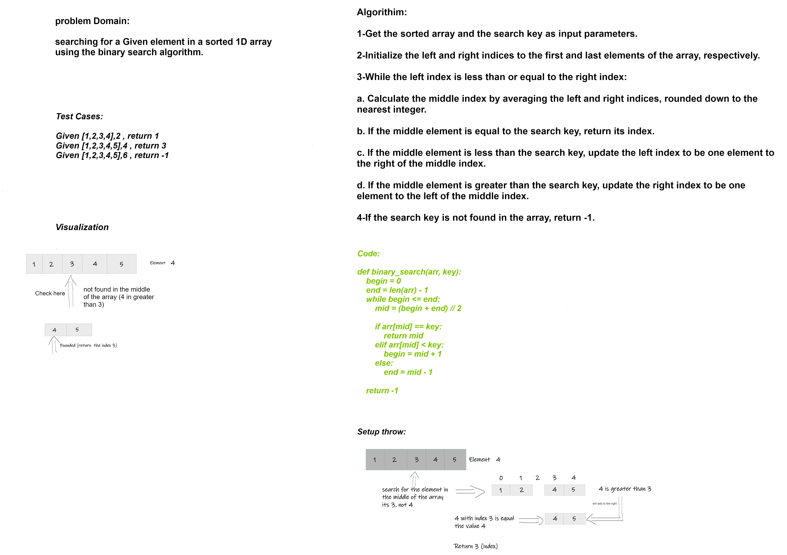

# Binary search in a sorted 1D array

## Write a function called BinarySearch which takes in 2 parameters: a sorted array and the search key. Without utilizing any of the built-in methods available to your language, return the index of the array’s element that is equal to the value of the search key, or -1 if the element is not in the array

---

## Whiteboard Process

---

## Approach & Efficiency

time: O(n) space: O(1)

---

## Solution

def binary_search(arr, key):

    begin = 0
    end = len(arr) - 1
    
    while begin <= end:
        mid = (begin + end) // 2
        
        if arr[mid] == key:
            return mid
        elif arr[mid] < key:
            begin = mid + 1
        else:
            end = mid - 1
    
    return -1
