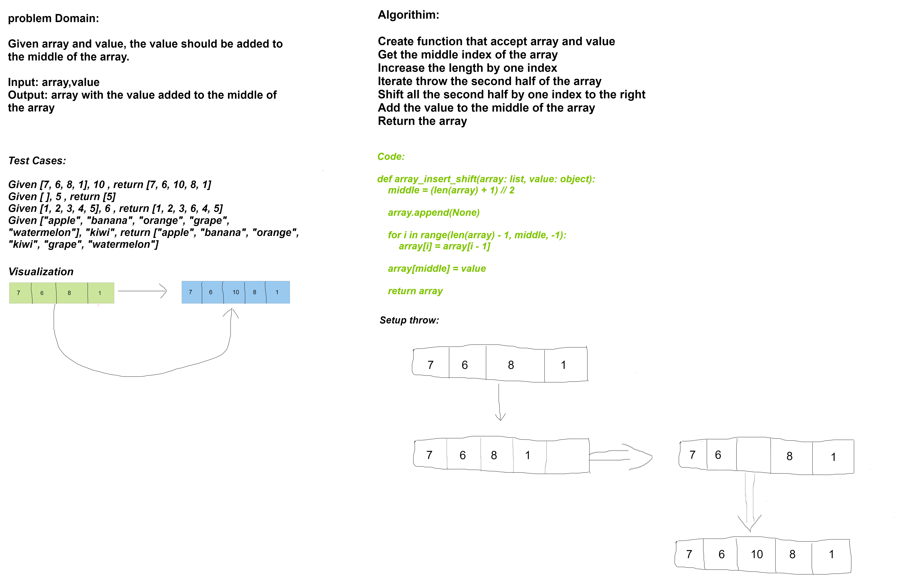

# Challenge Title
### Write a function called insertShiftArray which takes in an array and a value to be added. Without utilizing any of the built-in methods available to your language, return an array with the new value added at the middle.

---

## Whiteboard Process



---
## Approach & Efficiency
**time: O(n) space: O(1)**

---
## Solution
``` 
def insertShiftArray(array: list, value: object):   
    middle = (len(array) + 1) // 2       
    
    array.append(None)                   
    
    for i in range(len(array) - 1, middle, -1):    
        array[i] = array[i - 1]

    array[middle] = value  
    return array

    