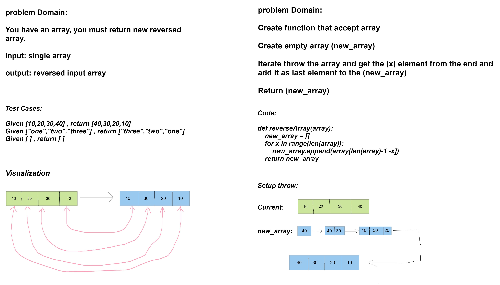

# Challenge Title
### Create function called reverseArray which takes an array as an argument. Without utilizing any of the built-in methods available in python language, return an array with elements in reversed order.

---

## Whiteboard Process



---
## Approach & Efficiency
**time: O(n) space: O(n)**

---
## Solution
``` 
def reverseArray(array):
    new_array = []
    for x in range(len(array)):
        new_array.append(array[len(array)-1 -x])
    return new_array

    