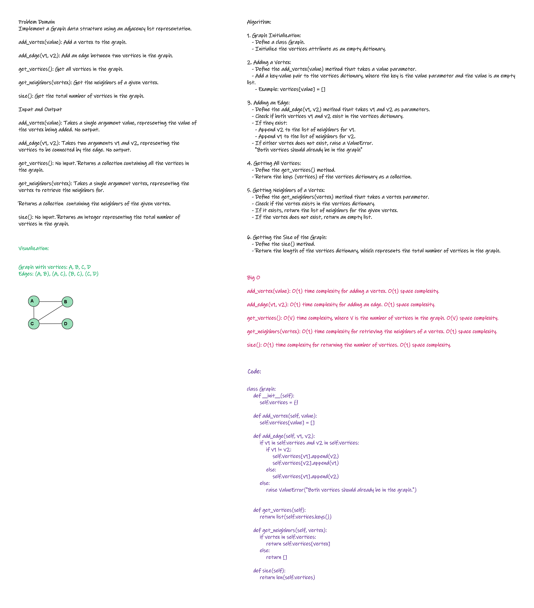

# Graph implementation
<!-- Description of the challenge -->
Implement your own Graph. The graph should be represented as an adjacency list

## Whiteboard Process
<!-- Embedded whiteboard image -->


## Approach & Efficiency
 
add_vertex(value): O(1) time complexity for adding a vertex. O(1) space complexity.

add_edge(v1, v2): O(1) time complexity for adding an edge. O(1) space complexity.

get_vertices(): O(V) time complexity, where V is the number of vertices in the graph. O(V) space complexity.

get_neighbors(vertex): O(1) time complexity for retrieving the neighbors of a vertex. O(1) space complexity.

size(): O(1) time complexity for returning the number of vertices. O(1) space complexity.

## Solution
<!-- Show how to run your code, and examples of it in action -->
```python
class Graph:
    def __init__(self):
        self.vertices = {}

    def add_vertex(self, value):
        self.vertices[value] = []

    def add_edge(self, v1, v2):
        if v1 in self.vertices and v2 in self.vertices:
            if v1 != v2:
                self.vertices[v1].append(v2)
                self.vertices[v2].append(v1)
            else:
                self.vertices[v1].append(v2)
        else:
            raise ValueError("Both vertices should already be in the graph.")


    def get_vertices(self):
        return list(self.vertices.keys())

    def get_neighbors(self, vertex):
        if vertex in self.vertices:
            return self.vertices[vertex]
        else:
            return []

    def size(self):
        return len(self.vertices)

```
