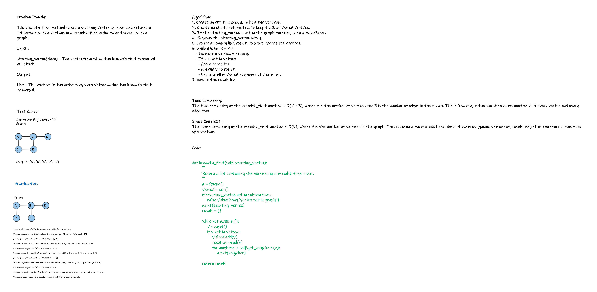

# Graph breadth-first
<!-- Description of the challenge -->
`Implement a breadth-first traversal on a graph.`

## Whiteboard Process
<!-- Embedded whiteboard image -->


## Approach & Efficiency
 
`Time Complexity:`

The time complexity of the breadth_first method is O(V + E), where V is the number of vertices and E is the number of edges in the graph. This is because, in the worst case, we need to visit every vertex and every edge once.

`Space Complexity:`

The space complexity of the breadth_first method is O(V), where V is the number of vertices in the graph. This is because we use additional data structures (queue, visited set, result list) that can store a maximum of V vertices.

## Solution
<!-- Show how to run your code, and examples of it in action -->
```python
# import Queue from queue
def breadth_first(self, starting_vertex):
        '''
        Return a list containing the vertices in a breadth-first order.
        '''
        q = Queue()
        visited = set()
        if starting_vertex not in self.vertices:
            raise ValueError("Vertex not in graph")
        q.put(starting_vertex)
        result = []

        while not q.empty():
            v = q.get()
            if v not in visited:
                visited.add(v)
                result.append(v)
                for neighbor in self.get_neighbors(v):
                    q.put(neighbor)

        return result

```
