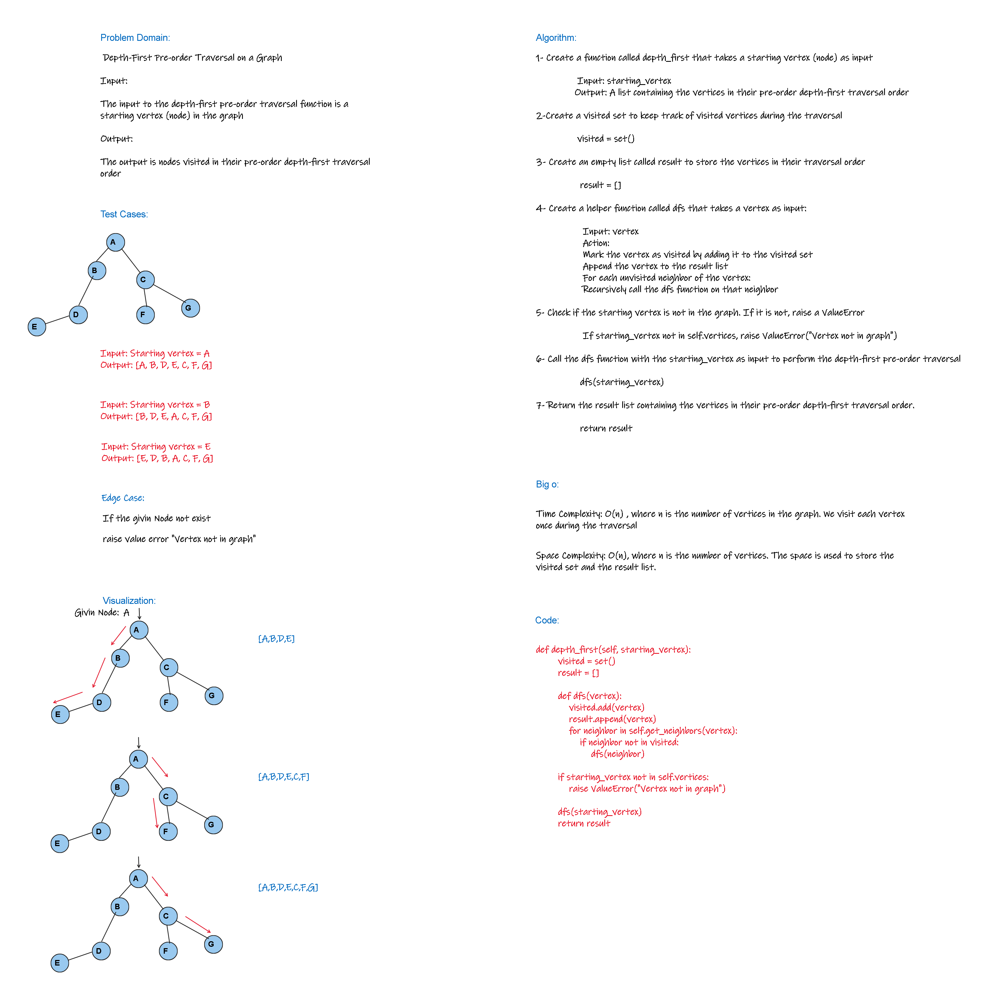

# graph-business-trip
<!-- Description of the challenge -->
`Conduct a depth first pre-order traversal on a graph`

## Whiteboard Process
<!-- Embedded whiteboard image -->


## Approach & Efficiency
 
`Time Complexity:`

 O(n) , where n is the number of vertices in the graph. We visit each vertex once during the traversal

`Space Complexity:`

O(n), where n is the number of vertices. The space is used to store the visited set and the result list

## Solution
<!-- Show how to run your code, and examples of it in action -->
```python
def depth_first(self, starting_vertex):
        visited = set()
        result = []

        def dfs(vertex):
            visited.add(vertex)
            result.append(vertex)
            for neighbor in self.get_neighbors(vertex):
                if neighbor not in visited:
                    dfs(neighbor)

        if starting_vertex not in self.vertices:
            raise ValueError("Vertex not in graph")

        dfs(starting_vertex)
        return result

```
