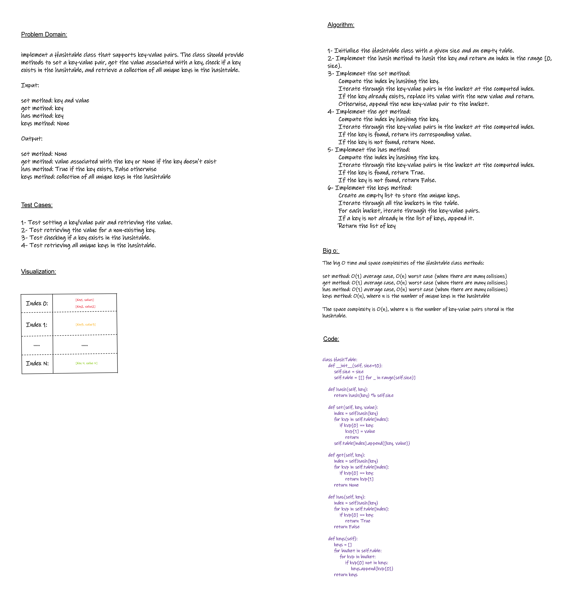

# Hash Table Implementation

`the task is to implement a Hashtable class with several methods that allow for efficient storage and retrieval of key-value pairs. The Hashtable class should handle collisions and provide functionality to set a key-value pair, get the value associated with a key, check if a key exists in the hashtable, and retrieve a collection of all unique keys in the hashtable.`

## Whiteboard Process



## Approach & Efficiency

The big O time and space complexities of the Hashtable class methods:

`set` method: O(1) average case, O(n) worst case (when there are many collisions)

`get` method: O(1) average case, O(n) worst case (when there are many collisions)

`has` method: O(1) average case, O(n) worst case (when there are many collisions)

`keys` method: O(n), where n is the number of unique keys in the hashtable

The `space` complexity is O(n), where n is the number of key-value pairs stored in the hashtable.

## Solution

```py
class HashTable:
    def __init__(self, size=10):
        self.size = size
        self.table = [[] for _ in range(self.size)]

    def hash(self, key):
        return hash(key) % self.size

    def set(self, key, value):
        index = self.hash(key)
        for kvp in self.table[index]:
            if kvp[0] == key:
                kvp[1] = value
                return
        self.table[index].append([key, value])

    def get(self, key):
        index = self.hash(key)
        for kvp in self.table[index]:
            if kvp[0] == key:
                return kvp[1]
        return None

    def has(self, key):
        index = self.hash(key)
        for kvp in self.table[index]:
            if kvp[0] == key:
                return True
        return False

    def keys(self):
        keys = []
        for bucket in self.table:
            for kvp in bucket:
                if kvp[0] not in keys:
                    keys.append(kvp[0])
        return keys

```
