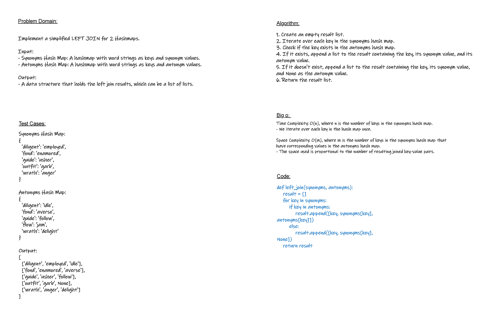

# HashMap LEFT JOIN

`Write a function that LEFT JOINs two hashmaps into a single data structure.`

## Whiteboard Process



## Approach & Efficiency

Time Complexity: O(n), where n is the number of keys in the synonyms hash map.

- We iterate over each key in the hash map once.

Space Complexity: O(m), where m is the number of keys in the synonyms hash map that have corresponding values in the antonyms hash map.

- The space used is proportional to the number of resulting joined key-value pairs.

## Solution

```py
def left_join(synonyms, antonyms):
    result = []
    for key in synonyms:
        if key in antonyms:
            result.append([key, synonyms[key], antonyms[key]])
        else:
            result.append([key, synonyms[key], None])
    return result
```
