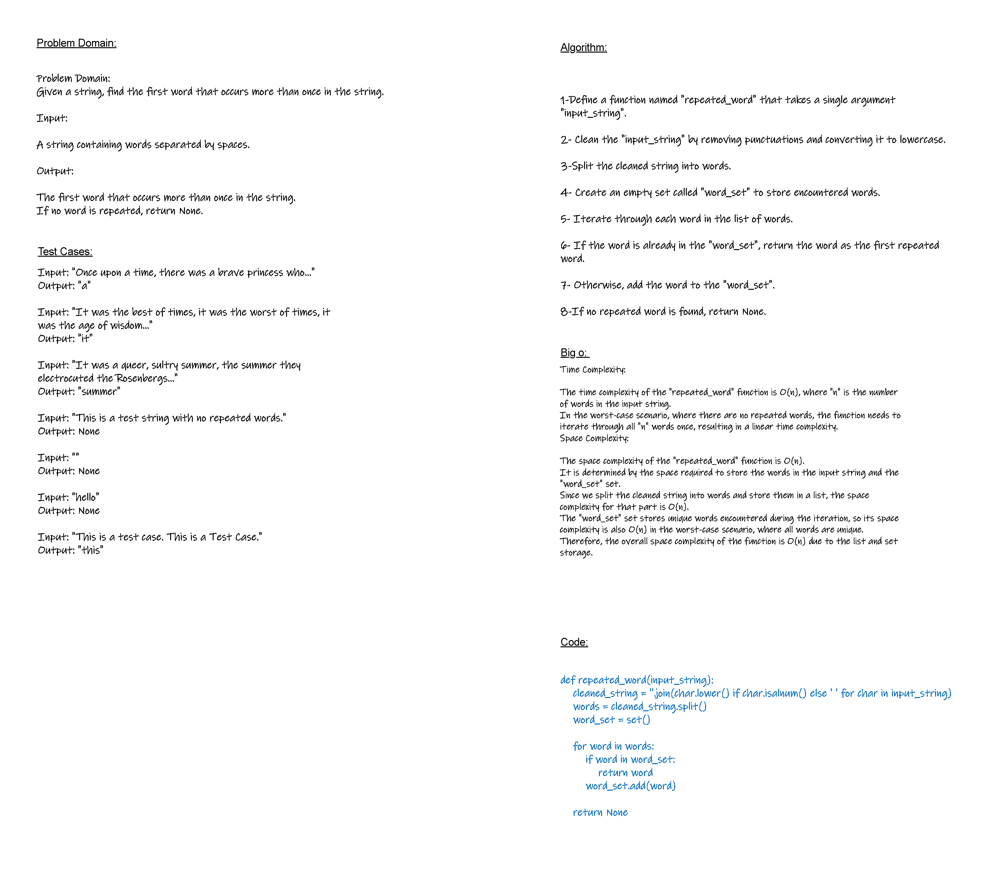

# Repeated Word
<!-- Description of the challenge -->
Find the first repeated word in the string.

## Whiteboard Process
<!-- Embedded whiteboard image -->


## Approach & Efficiency
<!-- What approach did you take? Why? What is the Big O space/time for this approach? -->
Time Complexity:

The time complexity of the "repeated_word" function is O(n), where "n" is the number of words in the input string.
In the worst-case scenario, where there are no repeated words, the function needs to iterate through all "n" words once, resulting in a linear time complexity.
Space Complexity:

The space complexity of the "repeated_word" function is O(n).
It is determined by the space required to store the words in the input string and the "word_set" set.
Since we split the cleaned string into words and store them in a list, the space complexity for that part is O(n).
The "word_set" set stores unique words encountered during the iteration, so its space complexity is also O(n) in the worst-case scenario, where all words are unique.
Therefore, the overall space complexity of the function is O(n) due to the list and set storage.

## Solution
<!-- Show how to run your code, and examples of it in action -->
```python
def repeated_word(input_string):
    cleaned_string = ''.join(char.lower() if char.isalnum() else ' ' for char in input_string)
    words = cleaned_string.split()
    word_set = set()

    for word in words:
        if word in word_set:
            return word
        word_set.add(word)

    return None
```
