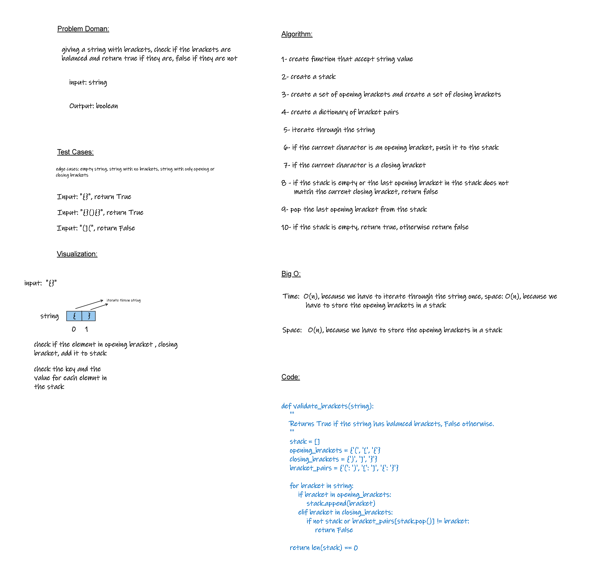

# Multi-bracket Validation
<!-- Description of the challenge -->

## Whiteboard Process



## Approach & Efficiency
<!-- What approach did you take? Why? What is the Big O space/time for this approach? -->

**time: O(n), because we have to iterate through the string once**.

**space: O(n), because we have to store the opening brackets in a stack**.

## Solution

```python
def validate_brackets(string):
    '''
    Returns True if the string has balanced brackets, False otherwise.
    '''
    stack = []
    opening_brackets = {'(', '[', '{'}
    closing_brackets = {')', ']', '}'}
    bracket_pairs = {'(': ')', '[': ']', '{': '}'}

    for bracket in string:
        if bracket in opening_brackets:
            stack.append(bracket)
        elif bracket in closing_brackets:
            if not stack or bracket_pairs[stack.pop()] != bracket:
                return False
    
    return len(stack) == 0
```
