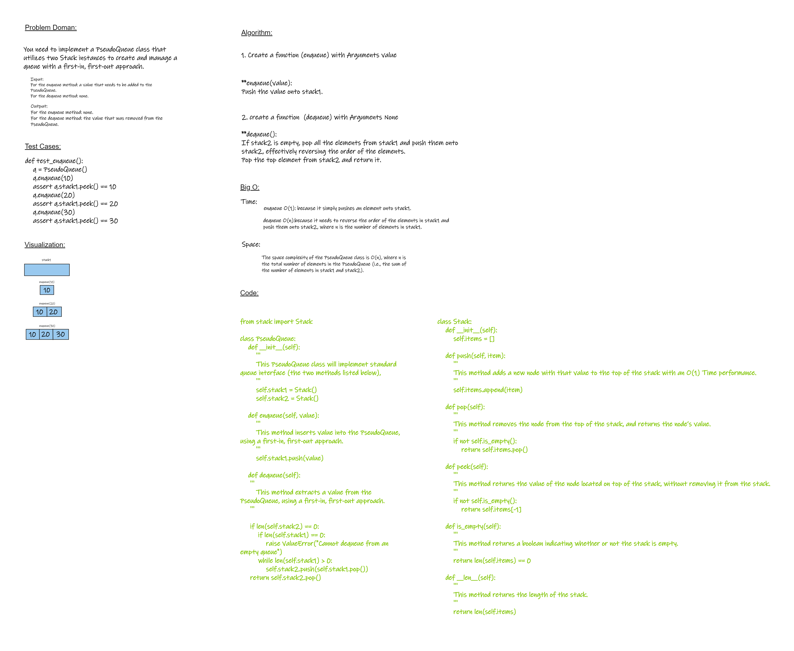

# Implement a Queue using two Stacks
<!-- Description of the challenge -->

## Whiteboard Process



## Approach & Efficiency
<!-- What approach did you take? Why? What is the Big O space/time for this approach? -->
**Time:**
enqueue O(1): because it simply pushes an element onto stack1.

dequeue O(n):because it needs to reverse the order of the elements in stack1 and push them onto stack2, where n is the number of elements in stack1.

**Space:**

The space complexity of the PseudoQueue class is O(n), where n is the total number of elements in the PseudoQueue (i.e., the sum of the number of elements in stack1 and stack2).

## Solution
<!-- Show how to run your code, and examples of it in action -->
pseudoqueue code

```python
from stack import Stack

class PseudoQueue:
    def __init__(self):
        '''
        This PseudoQueue class will implement standard queue interface (the two methods listed below),
        '''
        self.stack1 = Stack()
        self.stack2 = Stack()

    def enqueue(self, value):
        '''
        This method inserts value into the PseudoQueue, using a first-in, first-out approach.
        '''
        self.stack1.push(value)

    def dequeue(self):
     '''
        This method extracts a value from the PseudoQueue, using a first-in, first-out approach.
     '''

     if len(self.stack2) == 0:
         if len(self.stack1) == 0:
             raise ValueError("Cannot dequeue from an empty queue")
         while len(self.stack1) > 0:
             self.stack2.push(self.stack1.pop())
     return self.stack2.pop()
```

stack code

```python
class Stack:
    def __init__(self):
        '''
        This method initializes an empty Stack.
        '''
        self.items = []

    def push(self, item):
        '''
        This method adds a new node with that value to the top of the stack with an O(1) Time performance.
        '''
        self.items.append(item)

    def pop(self):
        '''
        This method removes the node from the top of the stack, and returns the node’s value.
        '''
        if not self.is_empty():
            return self.items.pop()

    def peek(self):
        '''
        This method returns the value of the node located on top of the stack, without removing it from the stack.
        '''
        if not self.is_empty():
            return self.items[-1]

    def is_empty(self):
        '''
        This method returns a boolean indicating whether or not the stack is empty.
        '''
        return len(self.items) == 0

    def __len__(self):
        '''
        This method returns the length of the stack.
        '''
        return len(self.items)

```
