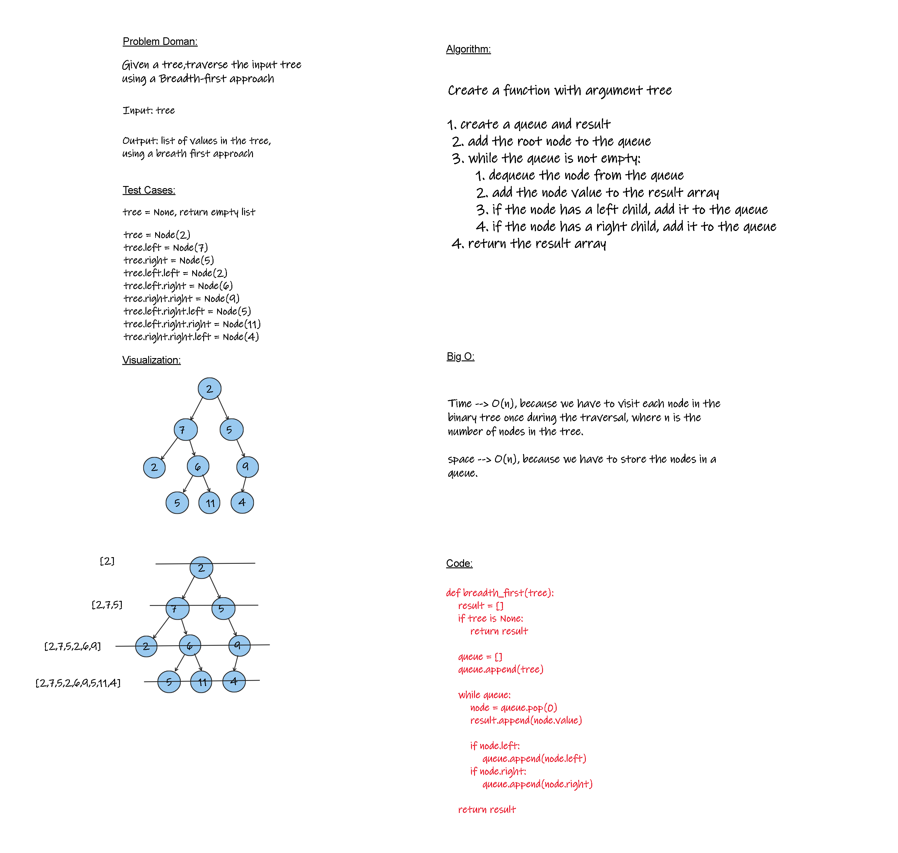

# Breadth-first Traversal
<!-- Description of the challenge -->

## Whiteboard Process
<!-- Embedded whiteboard image -->


## Approach & Efficiency

time: O(n), because we have to visit each node in the binary tree once during the traversal, where n is the number of nodes in the tree.

space: O(n), because we have to store the nodes in a queue.

## Solution
<!-- Show how to run your code, and examples of it in action -->
```python
def breadth_first(tree): 
    result = [] 
    if tree is None:
        return result

    queue = []
    queue.append(tree) 

    while queue:
        node = queue.pop(0)
        result.append(node.value)

        if node.left:
            queue.append(node.left)
        if node.right:
            queue.append(node.right)

    return result
```
