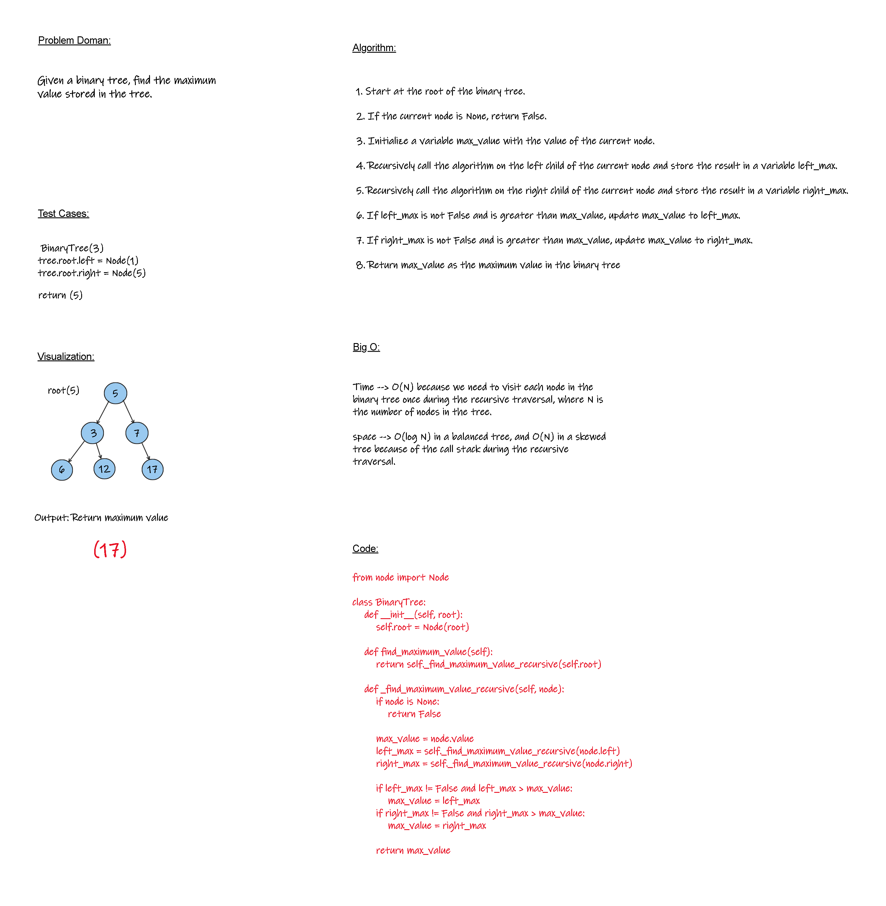

# find-maximum-value

## Whiteboard Process
<!-- Embedded whiteboard image -->


## Approach & Efficiency

**Time** --> O(N) because we need to visit each node in the binary tree once during the recursive traversal, where N is the number of nodes in the tree.

**space** --> O(log N) in a balanced tree, and O(N) in a skewed tree because of the call stack during the recursive traversal.

## Solution

```python
from node import Node

class BinaryTree:
    def __init__(self, root):
        self.root = Node(root)

    def find_maximum_value(self):
        return self._find_maximum_value_recursive(self.root)

    def _find_maximum_value_recursive(self, node):
        if node is None:
            return False

        max_value = node.value
        left_max = self._find_maximum_value_recursive(node.left)
        right_max = self._find_maximum_value_recursive(node.right)

        if left_max != False and left_max > max_value:
            max_value = left_max
        if right_max != False and right_max > max_value:
            max_value = right_max

        return max_value

```
