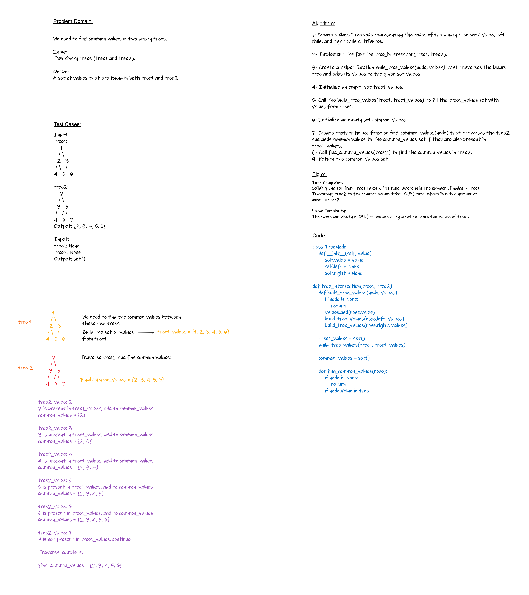

# Find common values in 2 binary trees
<!-- Description of the challenge -->
Find common values in 2 binary trees.

## Whiteboard Process
<!-- Embedded whiteboard image -->


## Approach & Efficiency
<!-- What approach did you take? Why? What is the Big O space/time for this approach? -->
`Time Complexity:`
Building the set from tree1 takes O(N) time, where N is the number of nodes in tree1.
Traversing tree2 to find common values takes O(M) time, where M is the number of nodes in tree2.

`Space Complexity:`
The space complexity is O(N) as we are using a set to store the values of tree1.

## Solution
<!-- Show how to run your code, and examples of it in action -->
```python
class TreeNode:
    def __init__(self, value):
        self.value = value
        self.left = None
        self.right = None

def tree_intersection(tree1, tree2):
    def build_tree_values(node, values):
        if node is None:
            return
        values.add(node.value)
        build_tree_values(node.left, values)
        build_tree_values(node.right, values)

    tree1_values = set()
    build_tree_values(tree1, tree1_values)

    common_values = set()

    def find_common_values(node):
        if node is None:
            return
        if node.value in tree

```
