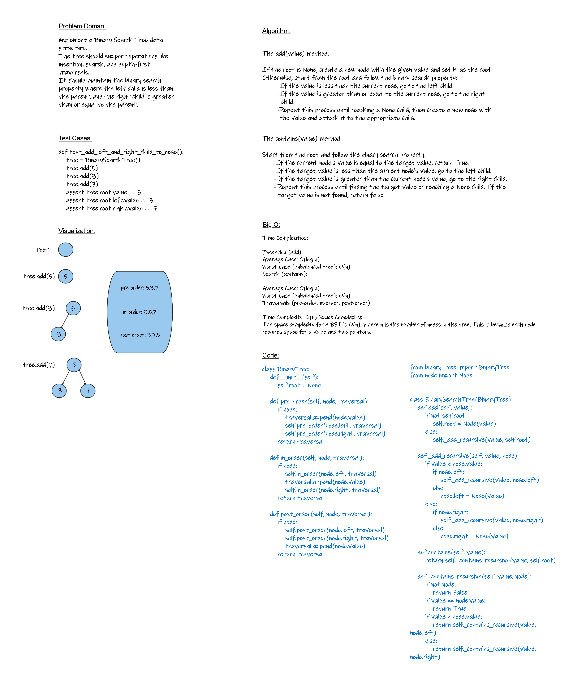

# Trees

## Whiteboard Process
<!-- Embedded whiteboard image -->


## Approach & Efficiency
<!-- What approach did you take? Why? What is the Big O space/time for this approach? -->
Time Complexities:

Insertion (add):

- Average Case: O(log n)
- Worst Case (unbalanced tree): O(n)

 Search (contains):

- Average Case: O(log n)
- Worst Case (unbalanced tree): O(n)

Traversals (pre-order, in-order, post-order):

- Time Complexity: O(n)
Space Complexity:

The space complexity for a BST is O(n), where n is the number of nodes in the tree. This is because each node requires space for a value and two pointers.

## Solution
<!-- Show how to run your code, and examples of it in action -->
```python
class Node:
    def __init__(self, value):
        self.value = value
        self.left = None
        self.right = None
```

```python
class BinaryTree:
    def __init__(self):
        self.root = None

    def pre_order(self, node, traversal):
        if node:
            traversal.append(node.value)
            self.pre_order(node.left, traversal)
            self.pre_order(node.right, traversal)
        return traversal

    def in_order(self, node, traversal):
        if node:
            self.in_order(node.left, traversal)
            traversal.append(node.value)
            self.in_order(node.right, traversal)
        return traversal

    def post_order(self, node, traversal):
        if node:
            self.post_order(node.left, traversal)
            self.post_order(node.right, traversal)
            traversal.append(node.value)
        return traversal

```

```python
from binary_tree import BinaryTree
from node import Node


class BinarySearchTree(BinaryTree):
    def add(self, value):
        if not self.root:
            self.root = Node(value)
        else:
            self._add_recursive(value, self.root)

    def _add_recursive(self, value, node):
        if value < node.value:
            if node.left:
                self._add_recursive(value, node.left)
            else:
                node.left = Node(value)
        else:
            if node.right:
                self._add_recursive(value, node.right)
            else:
                node.right = Node(value)

    def contains(self, value):
        return self._contains_recursive(value, self.root)

    def _contains_recursive(self, value, node):
        if not node:
            return False
        if value == node.value:
            return True
        if value < node.value:
            return self._contains_recursive(value, node.left)
        else:
            return self._contains_recursive(value, node.right)

```
